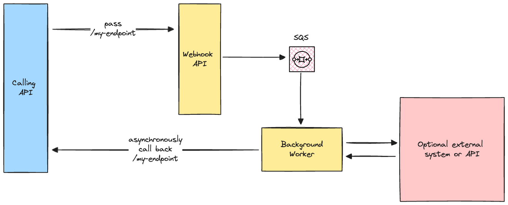

# Golang Webhook API

This project was built primarily to satisfy my own curiosity when implementing a scalable webhook API, worthy of handling production environment workloads and failure modes. The idea is that this service can either be run as a standalone event-driven microservice or as a makeshift adapter to convert synchronous API integrations into asynchronous ones. This was an enjoyable pet project since I got to play with newer features from the Go language such as the advanced mux router and the built-in structured logging package.

## Architecture

The solution consists of an API Gateway which accepts incoming requests and forwards them to an SQS Queue. And a worker service which listens for and processes new messages from the SQS Queue. Once the worker has completed each task for a single message it makes an asynchronous request back to the endpoint provided from the calling API.



## Pre-requisites

You will need to have the following installed on your local machine to run this project:
- [Golang](https://golang.org/)
- [Docker](https://www.docker.com/)
- [Docker Compose](https://docs.docker.com/compose/)
- [AWS CLI](https://aws.amazon.com/cli/)

## Getting Started

1. Set up your local environment by installing localstack and local AWS infrastructure via docker-compose.
   2. Run the command `make local-env-up`
   3. Create queue by running the command `make create-local-queues`
4. To run the tests, do `make test`
5. To run the application, do `go run cmd/api/main.go`
6. To run the background worker, do `go run cmd/worker/main.go`
7. To simulate a webhook request run the following curl command ```curl --request POST \
   --url http://localhost:8080/api/jobs \
   --header 'Content-Type: application/json' \
   --data '{
   "callback_url": "http://localhost:8080/api-2/complete"
   }'```
5. To bring down the local environment, run the command `make local-env-down`
